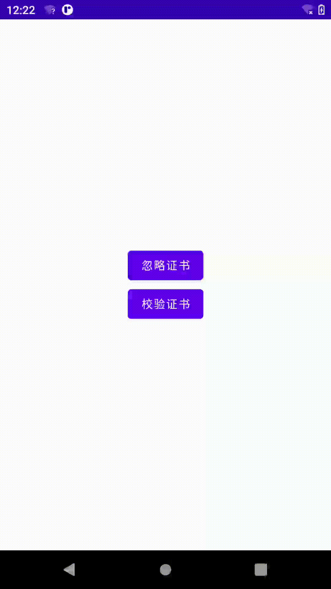

# CertSSH

## Android端通过https访问服务端，使用有证书和无证书且信任所有服务器两种方式各自访问

#### 生成服务端证书
##### keytool -genkey -v -alias server -keypass 123456 -keyalg RSA -keysize 1024 -validity 732 -storepass 123456 -storetype PKCS12 -keystore server.key.p12

#### 导出服务端cer证书
##### keytool -export -alias server -keystore server.key.p12 -storetype PKCS12 -keypass 123456 -file server.cer
